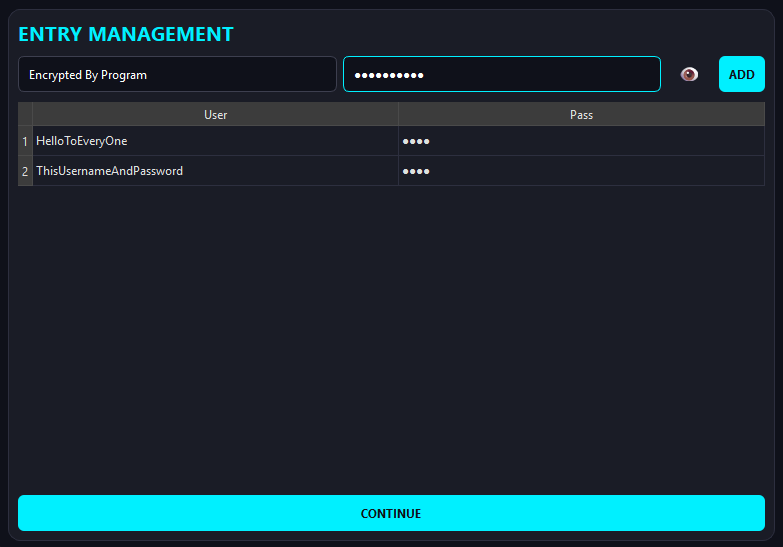
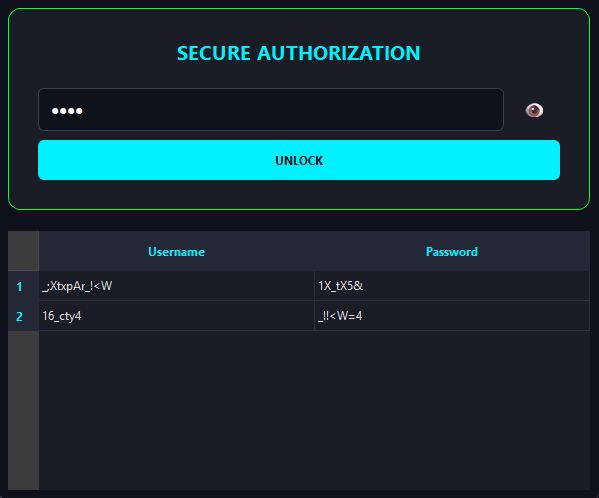

# 🛡️ Tech-Vault: Modern Stealth Password Manager

**Tech-Vault** is a high-security, offline password management system designed with a "Zero-Storage" philosophy for master credentials. Unlike traditional managers, Tech-Vault doesn't just encrypt your data; it compiles a unique, standalone executable specifically for your credentials, using your master password as a volatile reconstruction key.

---

**🚀 Key Features**

- **Modern Technological UI:** A sleek, minimalist dark-mode interface built with PySide6.
- **Zero Master Pass Storage:** Your Master Password is never stored on disk or in the code. It is used as a mathematical "seed" to navigate the hash-map in real-time.
- **Self-Compiling Architecture:** The Setup GUI (`main_gui.py`) generates a secure, standalone `.exe` (`runner_gui.exe`) containing your encrypted payload.
- **Stealth Mode:** The generated executable runs in `--windowed` mode, meaning no ugly terminal windows—just a clean, professional GUI.
- **Advanced Encryption Logic:** Uses a combination of SHA-512, Base85 encoding, and custom character mapping to prevent brute-force attacks.
- **Secure Cleanup:** Automatically destroys temporary JSON data maps after the compilation process.

---

**🧠 How It Works (The Logic)**

The security of Tech-Vault relies on a two-stage process:

**Stage 1: The Setup (`main_gui.py`)**
1. **Input:** You enter your usernames and passwords.
2. **Mapping:** The system generates a "Salt-Map" based on unique characters in your data.
3. **Hash Generation:** It uses your **Master Password** to create a series of hash-tables (`list_of_encrypted`).
4. **Payload Bundling:** All metadata (indices and tables) are dumped into `vault_data.json` and compiled into the `runner_gui.exe` using PyInstaller.
5. **Destruction:** The JSON file is deleted immediately after compilation.

**Stage 2: The Runner (**`runner_gui.exe`**)**
1. **Authorization:** You enter your Master Password.
2. **Volatile Reconstruction:** The program uses the input characters to re-map the bundled tables. If even one character is wrong, the resulting hashes will be invalid, and decryption will fail.
3. **No Trace:** Once you close the app, the decrypted data is wiped from the RAM.

---

**🛠️ Installation**

1. **Clone the repository:**

`git clone https://github.com/your-username/tech-vault.git`  
`cd tech-vault`

2. **Install dependencies:**

`pip install PySide6 pyinstaller`

---

**📖 Usage Guide**

1. **Run the Setup:**

`python main_gui.py`

2. **Add your credentials** using the modern table interface. Click the 👁️ icon to verify your entries.
3. **Set a Master Password:** Ensure it meets the minimum character requirement shown in the UI.
4. **Compile:** Click "Generate Secure EXE". Wait for the process to finish.
5. **Access:** Find your standalone `runner_gui.exe` in the `dist/` folder. You can now delete the source files and just keep the EXE!

---

**🎨 UI Preview**

- **Step 1:** Data entry with hidden password fields and neon aesthetics.
- **Step 2:** Secure Master Key set up.
- **Step 3:** Real-time compilation console.
- **Runner:** Minimalist login box that glows **Green** on success or **Red** on failure.

  
  
   
  <i>Tech-Vault Setup and Runner Interfaces</i>

---

**⚠️ Disclaimer**

This tool is designed for personal, offline security. While the encryption logic is robust, always keep a backup of your master password. Since the password is never stored, **it cannot be recovered if lost.**

**🤝 Contributing**

Contributions are welcome! If you have ideas for improving the mapping logic or the UI, feel free to fork the repo and submit a PR.

---
*Created with ❤️ for the Privacy Community.*
